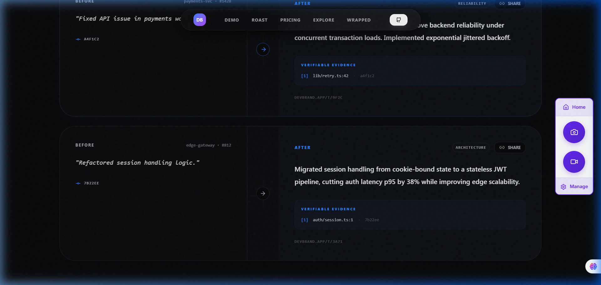
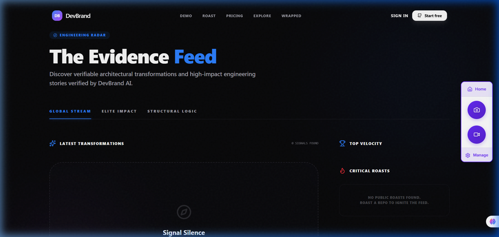
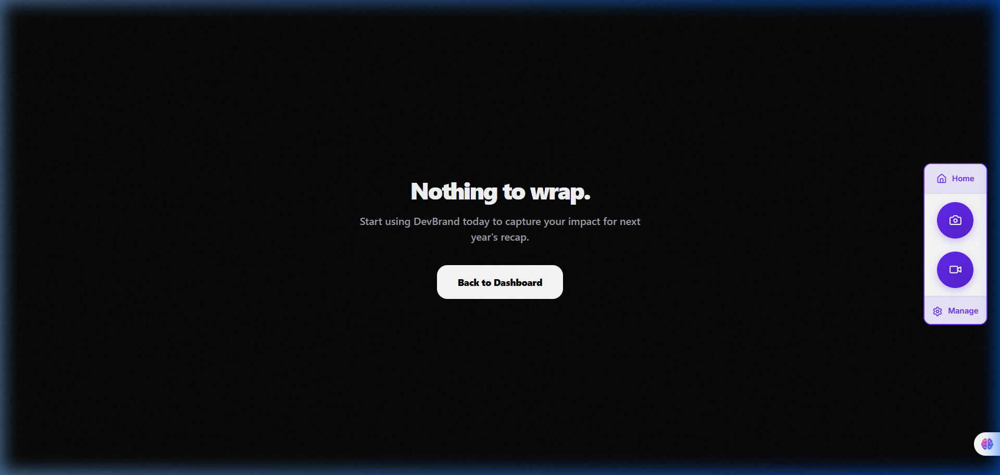

# <p align="center">✦ DevBrand ✦</p>
<p align="center"><b>Transforming the Invisible Labor of Engineering into Verifiable Career Leverage</b></p>

<p align="center">
  
</p>

---

## 🌌 The Vision
Engineers are the architects of the digital world, yet our impact is often reduced to bullet points on a flat resume. **DevBrand** is the antidote. It's a high-fidelity reputation engine that bridges the gap between raw code and human-readable impact. 

We don't just count lines; we analyze **architectural shifts**, **reliability wins**, and **structural logic**.

---

## 🚀 Elite Features

### 🧠 Neural Impact Analysis (Layer 0-7)
Our multi-layer analysis engine dissects your Pull Requests to find the "hidden" value.
- **Static Rigor**: Complexity and churn analysis.
- **Structural Shifts**: Dependency graph mapping and PageRank scoring.
- **Invisible Work**: Identification of refactors and reliability hardening.

### 🛡️ Systems of Proof
Every narrative generated is backed by **verifiable evidence**. No hype, just code citations that point directly to your commits.
<p align="center">
  
</p>

### 📡 The Engineering Radar
A global, real-time feed of the most impactful transformations happening across the ecosystem.
<p align="center">
  
</p>

---

## 🛠️ Technical Architecture
Built on the bleeding edge of the TanStack ecosystem:
- **Full-Stack**: [TanStack Start](https://tanstack.com/router/v1/docs/start/overview) (React-first)
- **Engine**: Physics-based animations with [Framer Motion](https://framer.com/motion)
- **Database**: Drizzle ORM + PostgreSQL
- **Real-Time**: Upstash Redis for global job queuing
- **Styling**: High-fidelity Dark Theme with glassmorphism tokens

---

## ⚙️ Installation & Setup

### 1. Requirements
- Node.js 18+
- PostgreSQL instance
- Redis (Upstash)

### 2. Quick Start
```bash
# Clone the repository
git clone https://github.com/bansalbhunesh/devbrand.git

# Install dependencies
npm install

# Setup environment variables
cp .env.example .env

# Push schema to database
npm run db:push

# Launch the engine
npm run dev
```

### 3. Environment Config
Ensure your `.env` contains the following elite credentials:
- `DATABASE_URL`: Your Postgres connection string.
- `UPSTASH_REDIS_REST_URL`: For global rate limiting and job queues.
- `GITHUB_CLIENT_ID`: OAuth application credentials.
- `SESSION_SECRET`: For encrypted session handling.

---

## 📈 Roadmap to Excellence
- [x] **Cinematic UI**: Physics-based interactive landing page.
- [x] **PR Intelligence**: Multi-layer analysis for narrative generation.
- [x] **The Radar**: Global transformation stream.
- [ ] **Wrapped 2026**: Personal impact recaps for every engineer.

<p align="center">
  
</p>

---

<p align="center">
  <b>Built for the Staff-Plus generation.</b><br>
  <i>DevBrand — Deniable no more.</i>
</p>
