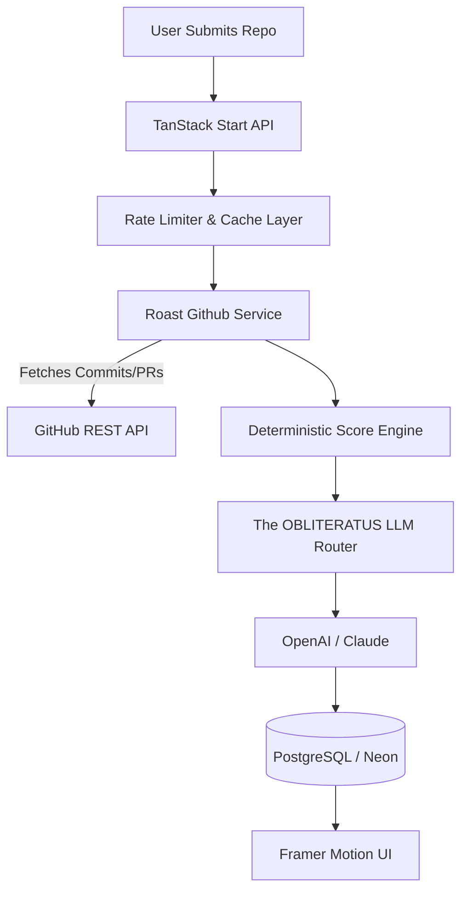

<div align="center">
  

  <h1>The Judgment Engine</h1>
  <p><b>Find out if your codebase is AI Slop.</b></p>

  [](https://github.com/bansalbhunesh/devbrand/actions)
  [](https://opensource.org/licenses/MIT)
  [](https://www.typescriptlang.org/)
</div>

---

## 🛑 The Problem

Most code analysis tools are polite, sanitized linters that tell you about missing semicolons. They ignore the real problems: deep architectural decay, the bus factor, and the influx of poorly-considered AI-generated boilerplate ("AI Slop"). 

## ⚡ The Solution

**DevBrand is The Judgment Engine.**
It is an unconstrained, brutally honest AI system that clones your GitHub repository's metadata, analyzes commit velocity, and renders a final, objective verdict on your architecture. 

It does not sugarcoat. It tells you exactly where your technical debt lies and what your execution velocity really looks like.

---

## ✨ Core Features

* **🧠 The OBLITERATUS Protocol**: A heavily constrained prompt architecture that forces the LLM into a highly-competent, cynical Staff Engineer persona. It is explicitly programmed to obliterate marketing fluff and deliver raw technical critique.
* **📊 Deterministic Slop Scoring**: Before the LLM even sees your code, the engine computes an `aiSlopScore` and `debtScore` using a strict heuristic of vague commits (`"fix"`, `"wip"`), empty PR descriptions, and the repository's bus factor.
* **⚡ 60-Second Ingestion**: Ingests the last 50 commits, open pull requests, and contributor dynamics to build a comprehensive execution profile.
* **🖼️ Dynamic OG Cards**: Automatically generates a highly-shareable, high-contrast OpenGraph card displaying your AI Slop percentage and "THE LINE" (the 25-word final verdict).
* **🔒 Opt-In Legacy Mode**: Features the original "Weekly Digest" builder logs, now securely gated behind the `FEATURE_REPO_ROAST=true` architecture flag while we scale the Judgment Engine.

---

## 🏗️ Architecture

DevBrand is engineered as a highly resilient, distributed monorepo built to handle viral influxes of repository analysis requests.



### The Tech Stack
- **Frontend**: TanStack Start / React 19 / Vite / Framer Motion (Web UI)
- **Backend**: Node.js / Server Functions
- **Database**: PostgreSQL (Neon) via Drizzle ORM
- **Visuals**: Satori & Resvg (Server-side OG image rendering)
- **Testing**: Playwright (Exhaustive E2E)

---

## 🚀 Getting Started

To run the Judgment Engine locally, ensure you have **Node 22**, **pnpm**, and **Docker** installed.

### 1. Clone & Install
```bash
git clone https://github.com/bansalbhunesh/devbrand.git
cd devbrand
pnpm install
```

### 2. Environment Setup
Copy the example environment file and add your keys. Ensure `FEATURE_REPO_ROAST=true` is set.
```bash
cp .env.example .env
```

### 3. Database Migration
```bash
pnpm run db:push
```

### 4. Run the Engine
```bash
pnpm run dev
```
The platform will be live at `http://localhost:3000`.

---

## 🧪 Testing

We rely on **Playwright** for exhaustive End-to-End testing across our entire stack.

```bash
# Run the E2E suite
pnpm exec playwright test

# View the test report
pnpm exec playwright show-report
```

---

<div align="center">
  <b>Unfiltered Honesty. No marketing fluff. Just the line.</b>
</div>
