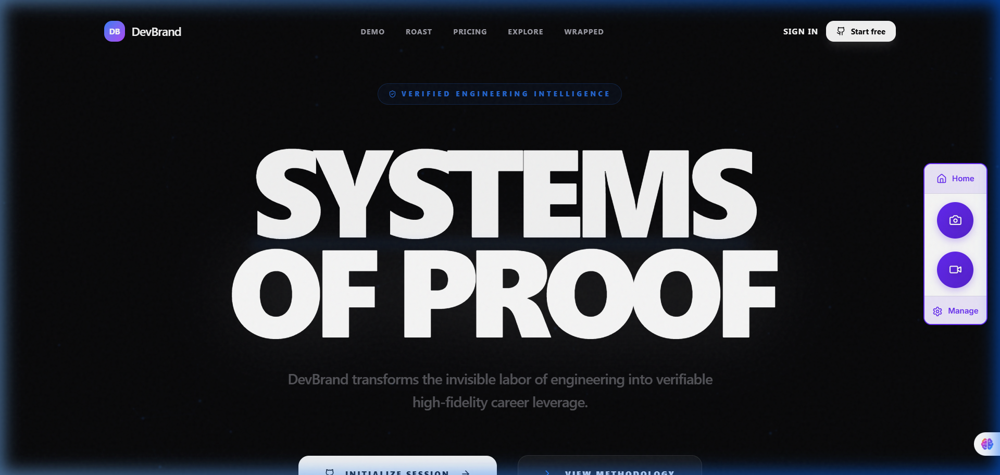
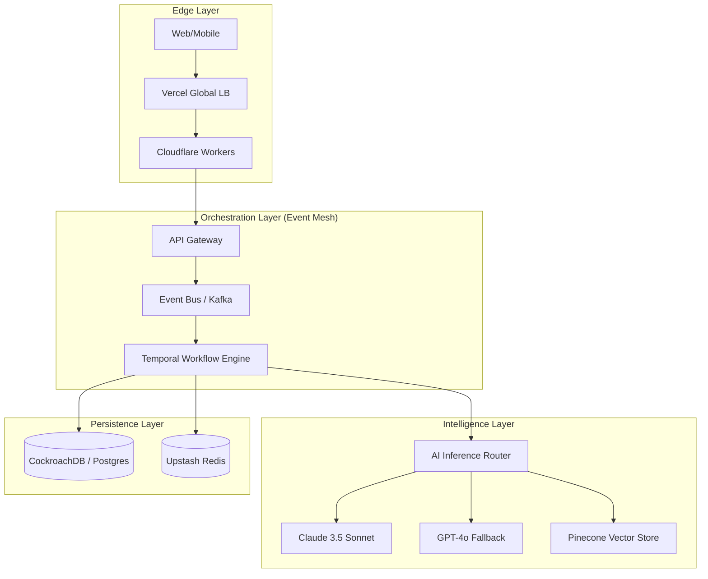

# <p align="center">✦ DEVB<span style="color: #00f2ff;">RAND</span> ✦</p>
<p align="center"><b>Production-Grade Neural Reputation Engine & Distributed Systems Intelligence</b></p>

<p align="center">
  
</p>

<p align="center">
  
  
  
  
</p>

---

## 🏛️ System Architecture

DevBrand is engineered as a high-reliability distributed monorepo, separating concerns across specialized domains. The system utilizes an asynchronous event mesh for reactive scaling and an intelligent inference router for model-agnostic AI orchestration.

### High-Level Topology


---

## 📂 Engineering Domain Map

### `apps/` - Delivery Vehicles
- **`web`**: Enterprise-grade dashboard built with TanStack Start, featuring physics-based motion systems and real-time observability.

### `modules/` - Domain Logic (BCS Pattern)
- **`core/`**: The system heartbeat. Contains the `EventBus` (retry/DLQ logic) and `WorkflowEngine`.
- **`billing/`**: Atomic subscription management and Stripe idempotency handlers.
- **`repos/`**: High-throughput repository synchronization and semantic analysis pipelines.
- **`digests/`**: Narrative generation and evidence-backed profiling.

### `packages/` - Shared Infrastructure
- **`ai-sdk/`**: Adaptive inference routing. Features automatic provider failover, token optimization, and prompt registry.
- **`telemetry/`**: OpenTelemetry wrappers for distributed tracing, metric aggregation, and centralized logging.
- **`repo-intelligence/`**: Multi-layer code dissection (Layer 0-7) for identifying structural shifts.

### `infrastructure/` - Core Services
- **`database/`**: Drizzle-managed schemas with strict Zod validation at the boundary.
- **`queues/`**: Background job orchestration with backpressure handling.

---

## 🛡️ Operational Excellence

### 1. Intelligent Inference Failover
Our AI infrastructure is designed for 99.99% availability. The `InferenceRouter` automatically detects provider latency or failures and shifts traffic to secondary models (e.g., Claude → GPT-4o) without user-facing impact.

### 2. Reactive Event Mesh
Built for eventual consistency and resilience:
- **Automatic Retries**: Exponential backoff for transient failures.
- **Dead Letter Queues (DLQ)**: Failed events are isolated for manual inspection and replay.
- **Telemetry**: Every event emission is traced via distributed spans.

### 3. Living Architecture Map
We provide an interactive, cinematic visualization of the entire system state. 
> **Access**: `architecture-map.html` in the root directory.
- Real-time flow particles.
- Service health overlays.
- Infrastructure hotspot detection.

---

## 🛠️ Implementation Guide

### Prerequisites
- Node.js `^20.0.0`
- Docker & Docker Compose
- Pnpm `^9.0.0` (Recommended)

### Development Lifecycle
```bash
# Install dependencies with frozen lockfile
pnpm install

# Initialize local infrastructure (Postgres, Redis)
docker-compose up -d

# Environment Provisioning
cp .env.example .env && direnv allow

# Database Migration
pnpm run db:push

# Launch Development Workspace
pnpm dev
```

### Testing Strategy
- **Unit**: `pnpm test` (Vitest)
- **Integration**: `pnpm test:integration` (Service boundary testing)
- **E2E**: `pnpm exec playwright test` (User flow validation)

---

## 🚀 Deployment & CI/CD

### GitOps Workflow
1. **Feature**: Develop in scoped branches.
2. **Analysis**: Automated PR dissection using the internal `repo-intelligence` package.
3. **Verify**: CI runs linting, type-checking, and full test suite.
4. **Deploy**: Blue-Green deployment to staging/production clusters.

### Infrastructure Providers
- **Computing**: Vercel / AWS EKS
- **State**: CockroachDB (Global Consistency)
- **Queue**: Upstash Redis
- **Observability**: Axiom / Datadog

---

## 📜 Security & Compliance
- **SOC2 Ready**: Audit logs for every administrative action.
- **Encryption**: TLS 1.3 in transit; AES-256 for sensitive persistence.
- **Auth**: Multi-factor authentication via GitHub/OpenID Connect.

---

<p align="center">
  <b>DevBrand — Built for the Staff-Plus generation.</b><br>
  <i>Architecting the future of engineering reputation.</i>
</p>
