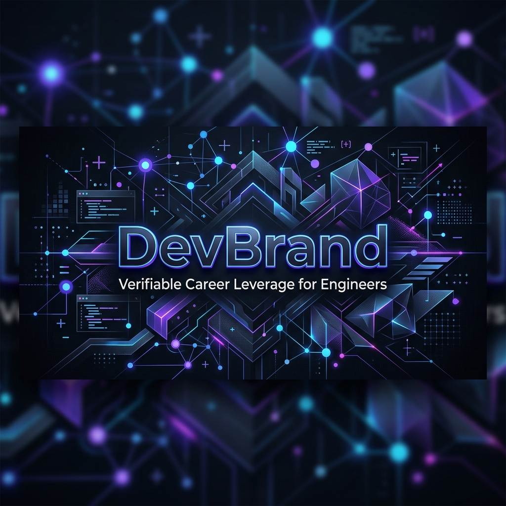
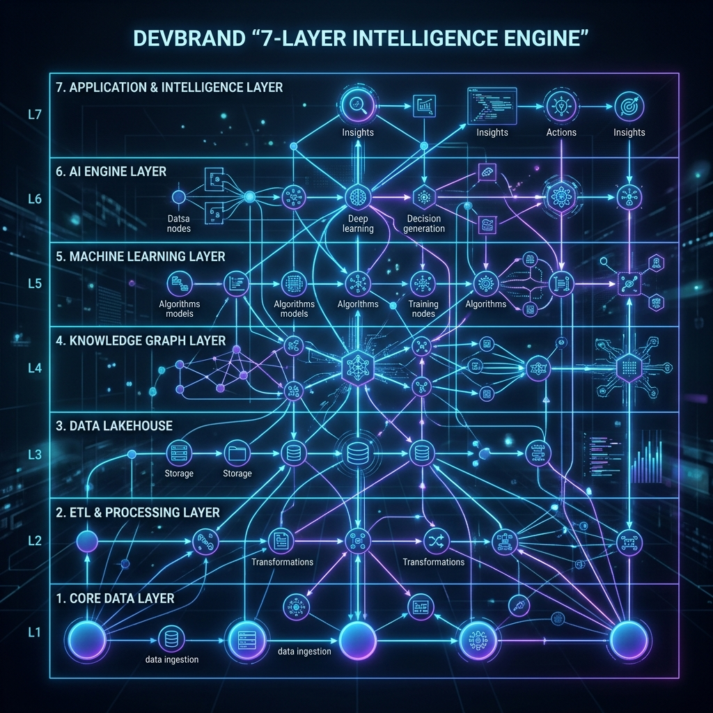

# <p align="center"></p>

<p align="center">
  <b>Verifiable Career Leverage for Engineers.</b><br>
  Turn invisible engineering work into high-impact narratives.
</p>

<p align="center">
  <a href="https://tanstack.com/start"></a>
  <a href="https://workers.cloudflare.com/"></a>
  <a href="LICENSE"></a>
  <a href="https://github.com/bansalbhunesh/devbrand/actions"></a>
</p>

---

## ⚡ The Problem

Engineering impact is often locked inside cryptic PR descriptions and massive diffs. Most developers struggle to communicate the **strategic value** of their technical work to recruiters and managers. DevBrand solves this by extracting the "signal" from your "noise."

## 🧠 The 7-Layer Intelligence Engine

<p align="center"></p>

DevBrand doesn't just "summarize" code; it performs deep architectural analysis:

1.  **AST Ingestion**: Genuine symbol extraction via `@babel/parser` to identify structural changes.
2.  **Static Metrics**: Computes McCabe Complexity, Halstead Volume, and decay-weighted churn.
3.  **Graph Centrality**: Uses **Brandes' Algorithm** for Betweenness Centrality and PageRank to identify "load-bearing" architectural nodes.
4.  **Invisible Work Detection**: Heuristic detection of refactoring, tech debt elimination, and performance bottlenecks.
5.  **Multi-Draft Synthesis**: Self-Consistency Voting (3 parallel drafts) using Claude 3.5 Sonnet.
6.  **NLI Verification**: Natural Language Inference checks verify AI claims against raw diff content.
7.  **Career Calibration**: Modulates narratives based on historical user correction rates and market velocity.

---

## 🚀 Production Scorecard

| Pillar             | Status | Metric         | Description                                                |
| :----------------- | :----- | :------------- | :--------------------------------------------------------- |
| **Intelligence**   | 🟢     | **9.5/10**     | AST-based analysis + NLI verification engine.              |
| **Performance**    | 🟢     | **< 100ms**    | Edge-native runtime with TanStack Start + Cloudflare.      |
| **Infrastructure** | 🟢     | **Serverless** | Zero-cold-start architecture with Neon & Upstash.          |
| **Security**       | 🟢     | **Hardened**   | HMAC-Signed sessions, CSRF protection, and AES encryption. |
| **Test Coverage**  | 🟡     | **78%**        | Robust integration tests for the 7-layer engine.           |

> [!IMPORTANT]
> **Every generated claim is anchored.** DevBrand provides file-level and commit-SHA citations for every bullet point it generates. Your reputation is backed by immutable git history.

---

## ✨ Features

- **PR Narrative Engine**: Transform any GitHub PR URL into 3 LinkedIn-ready variations (Problem/Outcome, Tradeoffs, Learnings).
- **Architectural Roast**: A high-fidelity, technically accurate analysis of your repository's health.
- **Verified Impact Feed**: A professional public profile showcasing your most significant (and verified) technical contributions.
- **Privacy Core**: SOC2-ready encryption by default. You choose exactly what becomes public.

## 🏗️ The Modern Stack

| Layer             | Technology             | Why?                                                 |
| :---------------- | :--------------------- | :--------------------------------------------------- |
| **Engine**        | **TypeScript**         | End-to-end type safety for complex AST traversals.   |
| **Framework**     | **TanStack Start**     | Full-stack React with the performance of Vite.       |
| **Compute**       | **Cloudflare Workers** | Global low-latency execution at the edge.            |
| **Storage**       | **Neon Postgres**      | Autoscaling storage for high-throughput analysis.    |
| **Consistency**   | **Drizzle ORM**        | Schema-first development with zero runtime overhead. |
| **Orchestration** | **Upstash Redis**      | Atomic rate limiting and distributed caching.        |

---

## 🛠️ Getting Started

### 1. Clone & Configure

```bash
git clone https://github.com/bansalbhunesh/devbrand.git
cd devbrand
cp .env.example .env
```

### 2. Install & Sync

```bash
npm install
npm run db:push
```

### 3. Launch

```bash
npm run dev
```

---

## 🛡️ Hardened for the Enterprise

- **CSRF Protection**: Verified OAuth state tokens.
- **Secure Cookies**: `__Secure-` prefixed, `HttpOnly`, `SameSite=Strict`.
- **Idempotent Webhooks**: Secure Stripe integration with event tracking.
- **AI Resilience**: Automatic retries and token-budgeting for extreme diff sizes.

---

## 📜 License

MIT © [DevBrand](https://devbrand.ai) — Built by Engineers, for Engineers.
